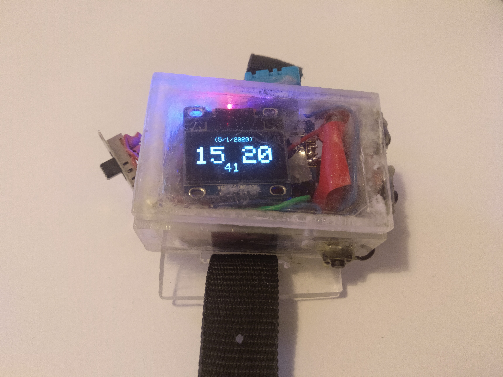

# Watch
Arduino code for a digital watch made using a Teensy 3.2 board.

time syncer: https://github.com/Peter-Searby/Watch-Sync-Time

Built and programmed in 2016, put on github in 2020 to ensure code doesn't get lost again
